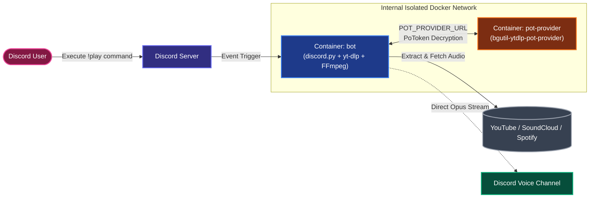

<div align="center">


# 🎀 Aigis Music Bot

</div>

<!-- Language Switcher Bar -->
<p align="center">
  <a href="#-tiếng-việt"><b>Tiếng Việt</b></a> •
  <a href="#-english"><b>English</b></a>
</p>

<!-- Professional Flat Badges Row 1: Core Tech & Status -->
<p align="center">
  <a href="https://github.com/2amkeyl/aigis-bot/releases/latest"></a>
  <a href="https://www.python.org/downloads/"></a>
  <a href="https://discordpy.readthedocs.io/"></a>
  <a href="https://www.docker.com/"></a>
  <a href="https://github.com/yt-dlp/yt-dlp"></a>
</p>

<!-- Professional Flat Badges Row 2: Stats & Community -->
<p align="center">
  <a href="https://github.com/2amkeyl/aigis-bot/stargazers"></a>
  <a href="https://github.com/2amkeyl/aigis-bot/network/members"></a>
  <a href="https://discord.gg/5XbvxEkCbG"></a>
  <a href="https://discord.com/users/1147592525696204822"></a>
  <a href="https://github.com/2amkeyl/aigis-bot/blob/main/LICENSE"></a>
  
</p>

---

<p align="center">
  <b>Một Discord Music Bot hiệu năng cao, tối ưu tài nguyên viết bằng Python & Docker.</b><br>
  Phát nhạc trực tiếp từ YouTube, SoundCloud & Spotify với luồng âm thanh Opus chất lượng cao và cơ chế bypass chặn IP.
</p>

</div>

---

<a name="-tiếng-việt"></a>
## Tiếng Việt

### 📑 Mục Lục

1. [Tổng quan](#tong-quan)
2. [Tính năng nổi bật](#tinh-nang-noi-bat)
3. [Kiến trúc hệ thống](#kien-truc-he-thong)
4. [Yêu cầu hệ thống](#yeu-cau-he-thong)
5. [Hướng dẫn cài đặt & Triển khai](#cai-dat-trien-khai)
6. [Danh sách lệnh (Commands)](#danh-sach-lenh)
7. [Kinh nghiệm triển khai VPS / Cloud 24/7](#trien-khai-vps)
8. [Xử lý sự cố (Troubleshooting)](#xu-ly-su-co)
9. [Công nghệ sử dụng](#cong-nghe-su-dung)
10. [Giấy phép & Bản quyền](#giay-phep-ban-quyen)

---

<a id="tong-quan"></a>
### 🌟 Tổng quan
**Aigis Music Bot** là giải pháp phát nhạc Discord self-hosted tinh gọn, ổn định và tối ưu tài nguyên phần cứng. Bot được lấy cảm hứng từ nhân vật **Aigis** trong tựa game *Persona 3 Reload*, tích hợp phản hồi hoàn toàn bằng tiếng Việt thân thiện, rõ ràng và mạch lạc.

> ⚠️ **Lưu ý về phương thức điều khiển:** Bot vận hành hoàn toàn bằng **tiền tố cố định (Prefix `!`)**, không sử dụng Slash Commands (`/`). Điều này giúp bot nhận diện lệnh tức thì, tối ưu độ trễ và không bị phụ thuộc vào phân quyền slash command phức tạp.

---

<a id="tinh-nang-noi-bat"></a>
### ✨ Tính năng nổi bật

* **🎵 Đa nguồn phát âm thanh:** Hỗ trợ link trực tiếp hoặc tìm kiếm theo từ khóa từ **YouTube**, **SoundCloud** và **Spotify** (Track / Album / Playlist).
* **🎶 Xử lý Spotify thông minh:** Trích xuất metadata bài hát qua Spotify Web API và tự động khớp nối bản thu chất lượng cao nhất trên YouTube để phát trực tiếp (bỏ qua giới hạn DRM).
* **🎧 Opus Passthrough Stream:** Ưu tiên truyền tải luồng Opus nguyên gốc từ nguồn phát đến Discord Voice Channel, hạn chế tối đa việc re-encode qua FFmpeg nhằm tiết kiệm CPU và giữ trọn dải âm.
* **🛡️ Chống chặn IP (Anti-Bot Bypass):** Tích hợp sẵn dịch vụ giải mã PoToken nội bộ (`bgutil-ytdlp-pot-provider`), giúp giải quyết triệt để vấn đề `429 Too Many Requests` và lỗi `Sign in to confirm you're not a bot` của YouTube khi chạy trên VPS/Datacenter.
* **🔁 Quản lý hàng đợi chuyên nghiệp:** Hỗ trợ xem danh sách chờ, xáo trộn bài hát (`shuffle`), cùng 3 chế độ lặp linh hoạt (Tắt / Lặp 1 bài / Lặp toàn bộ hàng đợi).
* **⚡ Tự động phục hồi (Auto-Reconnect):** Cơ chế tự động kết nối lại luồng audio khi mạng bị gián đoạn giữa chừng mà không làm gián đoạn cả phiên nghe nhạc.

---

<a id="kien-truc-he-thong"></a>
### 🏗️ Kiến trúc hệ thống

Hệ thống được đóng gói thành **2 container độc lập** cùng chạy trong một mạng nội bộ:

```text
docker-compose.yml
├── 🤖 bot           → Xử lý lệnh, trích xuất luồng audio và kết nối Voice Channel
└── 🛡️ pot-provider  → Tạo và giải mã PoToken giúp vượt cơ chế bot-check của YouTube
```

<a id="yeu-cau-he-thong"></a>
### 📦 Yêu cầu hệ thống

- **Docker:** Phiên bản `>= 20.10` & **Docker Compose** `>= v2.0`.
- **Discord Bot Token:** Tạo tại [Discord Developer Portal](https://discord.com/developers/applications) *(Cần bật **Server Members Intent** & **Message Content Intent**)*.
- *(Tùy chọn)* **Spotify API Credentials:** Client ID & Client Secret lấy từ [Spotify Developer Dashboard](https://developer.spotify.com/dashboard).


<a id="cai-dat-trien-khai"></a>
### 🚀 Hướng dẫn cài đặt & Triển khai

#### 1. Clone mã nguồn
```bash
git clone https://github.com/2amkeyl/aigis-bot.git
cd aigis-bot
```

#### 2. Thiết lập biến môi trường
Tạo file `.env` tại thư mục gốc:
```bash
cp .env.example .env  # hoặc tạo file .env mới
```

Điền các thông số tương ứng vào `.env`:
```env
# [BẮT BUỘC] Token Bot Discord của bạn
TOKEN=your_discord_bot_token_here

# [TÙY CHỌN] Cấu hình Spotify (Bỏ trống nếu không dùng link Spotify)
SPOTIFY_CLIENT_ID=your_spotify_client_id
SPOTIFY_CLIENT_SECRET=your_spotify_client_secret

# [DEBUG] Đặt 1 để in chi tiết log yt-dlp, đặt 0 khi chạy thực tế
YTDLP_DEBUG=0
```

> 🔒 **Cảnh báo bảo mật:** Tuyệt đối không đẩy file `.env` lên GitHub hoặc chia sẻ token bot cho bất kỳ ai.

#### 3. Khởi chạy với Docker Compose (Khuyên dùng)
```bash
# Build và chạy ngầm bot cùng dịch vụ PoToken
docker compose up -d --build

# Xem log hoạt động trực tiếp của bot
docker compose logs -f bot

# Dừng bot
docker compose down
```

---

<a id="danh-sach-lenh"></a>
### 🕹️ Danh sách lệnh (Commands)

> Toàn bộ lệnh đều sử dụng tiền tố cố định `!`

| Lệnh | Cú pháp | Yêu cầu Voice | Mô tả chi tiết |
| :--- | :--- | :---: | :--- |
| `!play` | `!play <tên bài / link URL>` (viết tắt: `!p`) | 🟢 Có | Tìm và phát nhạc từ YouTube, SoundCloud, Spotify hoặc nạp vào hàng đợi. |
| `!skip` | `!skip` | 🟢 Có | Bỏ qua bài hát đang phát và chuyển sang bài kế tiếp. |
| `!pause` | `!pause` | 🟢 Có | Tạm dừng phát luồng âm thanh hiện tại. |
| `!resume` | `!resume` | 🟢 Có | Tiếp tục phát lại bài hát đang tạm dừng. |
| `!queue` | `!queue` (viết tắt: `!q`) | ⚪ Không | Hiển thị danh sách các bài hát đang chờ trong hàng đợi. |
| `!loop` | `!loop` / `!loop all` / `!loop off` | 🟢 Có | Chuyển chế độ lặp: lặp 1 bài / lặp cả hàng đợi / tắt chế độ lặp. |
| `!shuffle`| `!shuffle` | 🟢 Có | Xáo trộn ngẫu nhiên toàn bộ danh sách bài hát trong hàng đợi. |
| `!stop` | `!stop` | 🟢 Có | Dừng nhạc ngay lập tức và xóa sạch toàn bộ hàng đợi. |
| `!leave` | `!leave` | ⚪ Không | Ngắt kết nối và yêu cầu bot rời khỏi kênh thoại. |
| `!help` | `!help` | ⚪ Không | Hiển thị bảng tóm tắt hướng dẫn các lệnh khả dụng. |

---

<a id="trien-khai-vps"></a>
### ☁️ Kinh nghiệm triển khai VPS / Cloud 24/7

Dự án được tối ưu để hoạt động ổn định trên các VPS cấu hình nhẹ (như Google Cloud `e2-micro` Always Free Tier hoặc Oracle Cloud Free Tier):

#### 1. Bật Swap Memory (Dành cho VPS RAM ≤ 1GB)
Để tránh hiện tượng Out-Of-Memory (OOM) khi Docker build và nạp thư viện:
```bash
sudo fallocate -l 2G /swapfile
sudo chmod 600 /swapfile
sudo mkswap /swapfile
sudo swapon /swapfile
echo '/swapfile none swap sw 0 0' | sudo tee -a /etc/fstab
```

#### 2. Khắc phục triệt để lỗi YouTube Bot-Check bằng Cookie
Nếu dải IP VPS của bạn bị YouTube gắn cờ bot-check:
1. Dùng tiện ích trình duyệt (ví dụ: *Get cookies.txt LOCALLY*) export file cookie từ tài khoản Google phụ ở định dạng Netscape.
2. Đặt file vào thư mục dự án với tên `cookies.txt`.
3. Mount vào `docker-compose.yml`:
   ```yaml
   services:
     bot:
       volumes:
         - ./cookies.txt:/app/cookies.txt:ro
   ```

---

<a id="xu-ly-su-co"></a>
### 🛠️ Xử lý sự cố (Troubleshooting)

<details>
<summary><b>1. Bot vào kênh thoại nhưng không phát ra tiếng rồi tự thoát?</b></summary>

- Kiểm tra xem FFmpeg hoặc các thư viện giải mã giọng nói (`libopus`, `PyNaCl`) đã được cài đặt hoàn chỉnh trong môi trường chạy hay chưa.
- Kiểm tra quyền hạn của Bot trong kênh thoại (cần quyền `Connect` và `Speak`).
</details>

<details>
<summary><b>2. Lỗi "Sign in to confirm you're not a bot" hoặc lỗi 429?</b></summary>

- Kiểm tra container `pot-provider` có đang chạy ổn định không: `docker compose logs pot-provider`.
- Tiến hành mount file `cookies.txt` theo hướng dẫn cấu hình VPS ở trên.
</details>

<details>
<summary><b>3. Bot không nhận link Spotify?</b></summary>

- Đảm bảo `SPOTIFY_CLIENT_ID` và `SPOTIFY_CLIENT_SECRET` trong file `.env` đã được điền chính xác.
- Đảm bảo playlist/album Spotify bạn chia sẻ đang ở chế độ Công khai (Public).
</details>

---

<a id="cong-nghe-su-dung"></a>
### 🧰 Công nghệ sử dụng

* **Ngôn ngữ:** [Python 3.12+](https://www.python.org/)
* **Discord API Wrapper:** [discord.py v2.x](https://github.com/Rapptz/discord.py)
* **Xử lý luồng âm thanh:** [yt-dlp](https://github.com/yt-dlp/yt-dlp) & [FFmpeg](https://ffmpeg.org/)
* **Tích hợp Spotify:** [Spotipy](https://github.com/spotipy-dev/spotipy)
* **Giải pháp Anti-Bot YouTube:** [bgutil-ytdlp-pot-provider](https://github.com/Brainicism/bgutil-ytdlp-pot-provider)
* **Container hóa:** [Docker](https://www.docker.com/) & [Docker Compose](https://docs.docker.com/compose/)

---

<a id="giay-phep-ban-quyen"></a>
### 📄 Giấy phép & Bản quyền

Dự án được phân phối dưới giấy phép **MIT License**. Xem chi tiết tại [LICENSE](LICENSE).

*Dự án được xây dựng phục vụ mục đích học tập và nghiên cứu phi thương mại. Vui lòng tuân thủ Điều khoản dịch vụ của YouTube và Spotify khi sử dụng.*

---

<a name="-english"></a>
## English

### 🌟 Overview

**Aigis Music Bot** is an efficient, production-ready music playback solution for Discord communities. Designed from the ground up to run effortlessly on low-spec Virtual Machines (such as Google Cloud `e2-micro` Always Free tier or Oracle Cloud Free Tier), it offers direct audio streaming with built-in YouTube anti-bot bypass mechanisms.

> ⚠️ **Control Mode:** The bot strictly uses the **fixed prefix `!`** for all commands (Slash commands `/` are intentionally omitted to minimize interaction latency and permission friction).

---

### ✨ Key Features

* **🎵 Multi-Platform Playback:** Seamlessly stream audio or search by track titles across **YouTube**, **SoundCloud**, and **Spotify** (Track / Album / Playlist).
* **🎶 Smart Spotify Metadata Resolution:** Leverages the [Spotify Web API](https://developer.spotify.com/) to parse track/album metadata and dynamically maps them to the highest matching audio stream on YouTube (bypassing DRM restrictions).
* **⚡ Native Opus Direct Passthrough:** Prioritizes untouched Opus audio streams directly to Discord Voice Channels, bypassing unnecessary FFmpeg re-encoding to save CPU cycles and preserve pristine acoustic fidelity.
* **🛡️ Built-in Anti-Bot Bypass:** Ships with a containerized [`bgutil-ytdlp-pot-provider`](https://github.com/Brainicism/bgutil-ytdlp-pot-provider) service to generate internal PoTokens, preventing YouTube `429 Too Many Requests` and bot-verification flags on datacenter IPs.
* **🔁 Complete Queue Management:** Full playback queue controls including inspect (`!queue`), shuffle (`!shuffle`), and a 3-state loop system (Off / Single Track / Entire Queue).
* **🛡️ Resilient Auto-Reconnect:** Automatic stream reconnection in the event of minor packet drops or network resets common in cloud environments.

---

### 🏗️ System Architecture



> 🔒 **Security Notice:** Both containers communicate exclusively within a private Docker bridge network via `POT_PROVIDER_URL`. No internal ports need to be exposed to the public Internet.

---

### 📦 Prerequisites

* **Docker Engine** (`>= 20.10`) & **Docker Compose** (`>= v2.0`).
* **Discord Bot Token** from the [Discord Developer Portal](https://discord.com/developers/applications) *(Ensure **Server Members Intent** & **Message Content Intent** are enabled)*.
* *(Optional)* **Spotify API Credentials** (Client ID & Client Secret) from [Spotify for Developers](https://developer.spotify.com/dashboard).

---

### 🚀 Installation & Deployment

#### 1. Clone the Repository
```bash
git clone https://github.com/2amkeyl/aigis-bot.git
cd aigis-bot
```

#### 2. Configure Environment Variables
Copy the template configuration:
```bash
cp .env.example .env
```

Populate `.env` with your credentials:
```env
# [REQUIRED] Discord Bot Token
TOKEN=your_discord_bot_token_here

# [OPTIONAL] Spotify Web API Credentials (Leave empty if Spotify is not required)
SPOTIFY_CLIENT_ID=your_spotify_client_id
SPOTIFY_CLIENT_SECRET=your_spotify_client_secret

# [DEBUG] Set to 1 for verbose yt-dlp diagnostic logs, 0 for standard production logs
YTDLP_DEBUG=0
```

> 🔒 **Security Warning:** Never commit your `.env` file to GitHub or share your bot token with anyone.

#### 3. Launch via Docker Compose (Recommended)
```bash
# Build images and start all services in the background
docker compose up -d --build

# Follow real-time bot application logs
docker compose logs -f bot

# Stop services when maintenance is required
docker compose down
```

---

### 🕹️ Command Reference

> All commands use the fixed prefix `!`.

| Command | Usage Example | Voice Req. | Description |
| :--- | :--- | :---: | :--- |
| `!play` | `!play <song name / URL>` (alias: `!p`) | 🟢 Yes | Searches and streams audio from YouTube, SoundCloud, Spotify, or enqueues it. |
| `!skip` | `!skip` | 🟢 Yes | Skips the current track and starts playing the next song in queue. |
| `!pause` | `!pause` | 🟢 Yes | Pauses the ongoing audio stream in the voice channel. |
| `!resume` | `!resume` | 🟢 Yes | Resumes playback of the currently paused track. |
| `!queue` | `!queue` (alias: `!q`) | ⚪ No | Displays the current playlist queue and upcoming tracks. |
| `!loop` | `!loop` / `!loop all` / `!loop off` | 🟢 Yes | Toggles repeat modes: single track / entire queue / disable loop. |
| `!shuffle`| `!shuffle` | 🟢 Yes | Randomizes the order of all tracks currently queued. |
| `!stop` | `!stop` | 🟢 Yes | Halts playback immediately and clears the entire queue. |
| `!leave` | `!leave` | ⚪ No | Disconnects the bot from the active voice channel. |
| `!help` | `!help` | ⚪ No | Displays the help summary guide and command usage syntax. |

---

### ☁️ VPS / Cloud Hosting Tips (24/7)

When self-hosting on cloud providers (Oracle Cloud, GCP Compute Engine, AWS, DigitalOcean, Hetzner):

#### 1. Configure Swap Space (For VMs with RAM ≤ 1GB)
Prevents Out-Of-Memory (OOM) fatal kills during Docker container compilation:
```bash
sudo fallocate -l 2G /swapfile
sudo chmod 600 /swapfile
sudo mkswap /swapfile
sudo swapon /swapfile
echo '/swapfile none swap sw 0 0' | sudo tee -a /etc/fstab
```

#### 2. YouTube Bot-Check Mitigation via Cookies
Datacenter IP ranges are frequently restricted by YouTube:
1. Export a Netscape-formatted cookie file from a secondary Google account using a browser extension (e.g., *Get cookies.txt LOCALLY*).
2. Place the file in the project root directory as `cookies.txt`.
3. Mount it read-only in `docker-compose.yml`:
   ```yaml
   services:
     bot:
       volumes:
         - ./cookies.txt:/app/cookies.txt:ro
   ```

---

### 🛠️ Troubleshooting

<details>
<summary><b>1. Bot joins the Voice Channel but emits no sound then leaves?</b></summary>

- Verify that voice libraries (`libopus`, `PyNaCl`) and FFmpeg are correctly installed.
- Ensure the bot application has sufficient server permissions (`Connect` and `Speak`) in Discord.
</details>

<details>
<summary><b>2. Error "Sign in to confirm you're not a bot" or HTTP 429?</b></summary>

- Inspect the PoToken container health: `docker compose logs pot-provider`.
- Mount a valid `cookies.txt` file as outlined in the VPS section above.
</details>

<details>
<summary><b>3. Spotify links fail to resolve?</b></summary>

- Double-check that `SPOTIFY_CLIENT_ID` and `SPOTIFY_CLIENT_SECRET` are correctly configured in `.env`.
- Ensure the requested Spotify track, album, or playlist is set to **Public**.
</details>

---

### 🧰 Tech Stack

* **Core Runtime:** [Python 3.12+](https://www.python.org/)
* **Discord API Wrapper:** [discord.py v2.x](https://github.com/Rapptz/discord.py)
* **Audio Extraction & Streaming:** [yt-dlp](https://github.com/yt-dlp/yt-dlp) & [FFmpeg](https://ffmpeg.org/)
* **Spotify Integration:** [Spotipy](https://github.com/spotipy-dev/spotipy)
* **Anti-Bot Provider:** [bgutil-ytdlp-pot-provider](https://github.com/Brainicism/bgutil-ytdlp-pot-provider)
* **Containerization:** [Docker](https://www.docker.com/) & [Docker Compose](https://docs.docker.com/compose/)

---

### 📄 License & Disclaimer

This project is licensed under the **MIT License**. See the [LICENSE](LICENSE) file for details.

*This project is distributed strictly for educational and personal non-commercial use. Please respect the [YouTube Terms of Service](https://www.youtube.com/t/terms) and [Spotify Terms and Conditions of Use](https://www.spotify.com/legal/end-user-agreement/).*

---

<div align="center">
  <p>Crafted with precision & passion by <a href="https://discord.com/users/1147592525696204822"><b>Keyl</b></a> • Join the community on our <a href="https://discord.gg/5XbvxEkCbG"><b>Discord Support Server</b></a> 🎧</p>
</div>
